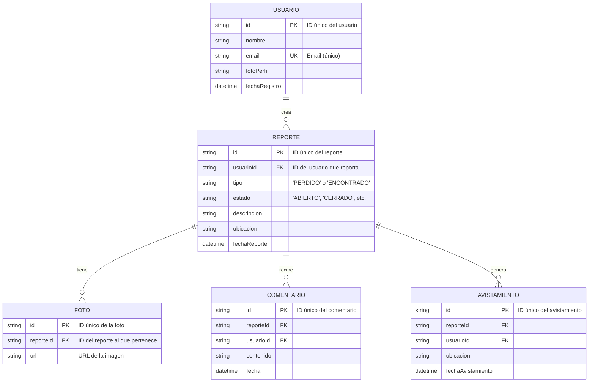

# 🐾 Michi Safe - Encuentra a tu Michi Perdido 🐱💕

<div align="center">
  
  <h3>Porque cada michi merece volver a casa 🏠❤️</h3>
</div>

---

## 🚀 ¿Qué es Michi Safe?

¡Hola, humano! 👋 ¿Perdiste a tu michi o encontraste uno que parece necesitar ayuda? ¡Estás en el lugar correcto!

**Michi Safe** es una plataforma web mágica ✨ que utiliza **Inteligencia Artificial** para reunir a gatitos perdidos con sus familias. Somos una comunidad de amantes de los gatos, armados con tecnología de punta y un deseo inmenso de ver colitas felices moviéndose de nuevo en sus hogares. 🏡

---

## 🎯 Superpoderes de Michi Safe

| Poder 😼          | Descripción 📜                                                                                             |
| ----------------- | ---------------------------------------------------------------------------------------------------------- |
| **🤖 MichiBot**     | Nuestro asistente chatbot con IA, listo para ayudarte 24/7. ¡Es como tener un detective de michis personal! |
| **📸 Búsqueda Visual** | Sube una foto y nuestra IA buscará coincidencias en la base de datos. ¡Reconoce hasta la manchita más pequeña! |
| **🗺️ Mapa de Alertas** | Un mapa interactivo que muestra reportes y avistamientos en tiempo real. ¡El GPS para michis perdidos!       |
| **💌 Reportes Fáciles** | Formularios súper sencillos para que reportar un gatito perdido o encontrado sea pan comido (o atún).       |
| **💖 Comunidad Activa** | Una red de héroes locales listos para ayudar en la búsqueda. ¡Juntos somos más fuertes!                     |

---

## 🛠️ La Magia Detrás del Telón (Tech Stack)

Este proyecto fue construido con mucho cariño y las siguientes tecnologías:

- **Frontend:** ⚛️ React, 🔷 TypeScript, 🌬️ Tailwind CSS
- **Inteligencia Artificial:** 🧠 Google Genkit, ✨ Gemini AI
- **UI:** 🎨 Shadcn-UI
- **Herramientas:** ⚡ Vite

---

## 🏗️ Arquitectura del Castillo (Estructura del Proyecto)

Así es como organizamos nuestras pociones y hechizos:

```bash
michi_safe/
│
├── 📁 genkit/                # 🧠 El cerebro de nuestra IA
│
├── 📁 public/                 # 🚪 Archivos de acceso público
│
├── 📁 src/                    # ❤️ El corazón de la aplicación
│   ├── 📁 assets/            # 🎨 Imágenes, íconos y fuentes
│   ├── 📁 components/         # 🧩 Piezas de LEGO reutilizables (Botones, Inputs)
│   │   └── 📁 michibot/      # 🤖 Todo lo relacionado a nuestro chatbot
│   ├── 📁 hooks/             # 🎣 Ganchos mágicos para la lógica
│   ├── 📁 lib/               # 📚 Biblioteca de utilidades
│   ├── 📁 pages/             # 📄 Las diferentes vistas de nuestra app
│   └── ...                   # Y otros secretos más...
│
├── 📄 .gitignore            # 📜 El pergamino de las cosas que ignoramos
├── 📄 package.json           # 📦 La lista de ingredientes del proyecto
├── 📄 README.md              # 📍 ¡Estás aquí!
└── 📄 tsconfig.json          # 룰 El libro de reglas de TypeScript
```

---

## 🗄️ Diagrama de Entidad-Relación (ERD)

Un vistazo a cómo se conectan nuestros datos. ¡Gracias a Mermaid.js, es interactivo en GitHub! 🪄



---

## 🚀 ¡Manos a la Obra! (Cómo Empezar)

¿Quieres unirte a la misión? ¡Genial! Sigue estos pasos para tener el proyecto corriendo en tu máquina:

1.  **Clona el repositorio:**
    ```bash
    git clone https://github.com/Orliluq/michi_safe.git
    ```

2.  **Entra en la carpeta:**
    ```bash
    cd michi_safe
    ```

3.  **Instala las dependencias (con npm, yarn o pnpm):**
    ```bash
    npm install
    ```

4.  **¡Lanza la aplicación!**
    ```bash
    npm run dev
    ```

¡Y listo! ✨ Ahora deberías poder ver la aplicación en `http://localhost:5173`.

---

## 💖 ¿Quieres Contribuir?

¡Toda ayuda es bienvenida! Ya sea reportando un bug 🐛, sugiriendo una nueva función 💡 o escribiendo código, tu contribución es valiosa. ¡Siéntete libre de abrir un *Pull Request*!

---

<div align="center">
  <p>Hecho con ❤️, ☕ y muchos ronroneos por la comunidad de Michi Safe.</p>
  
</div>